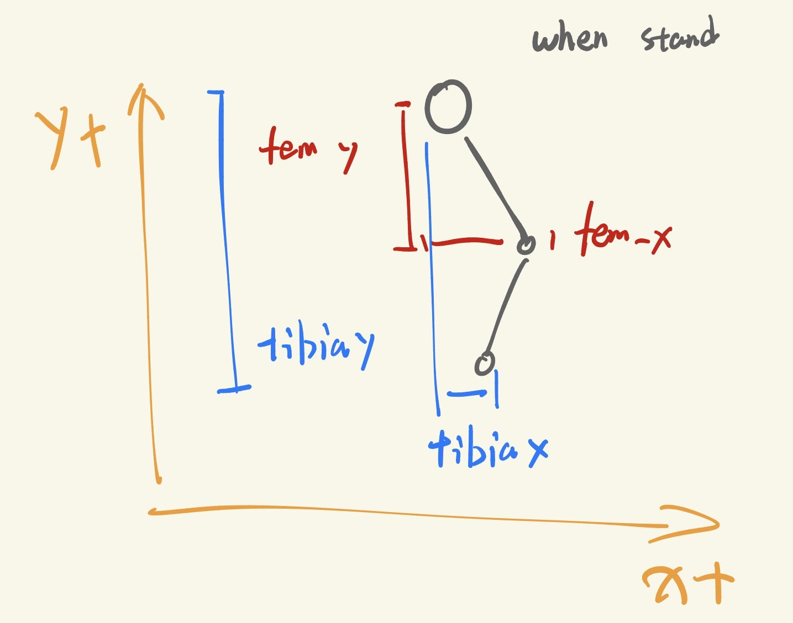

# Mastiff —— 四足机器人运动控制学习平台

> **面向本科生学期研究项目** | 基于 [Isaac Lab](https://github.com/isaac-sim/IsaacLab) · PPO · RSL-RL

本项目以自研四足机器人 **Mastiff**（12 自由度）为载体，在 NVIDIA Isaac Lab 仿真环境中，
使用强化学习（Reinforcement Learning, RL）训练机器人在平地与复杂地形上行走。
项目结构清晰、模块化设计，适合同学们以小组形式分工探索不同研究方向：
奖励成形、步态生成、地形课程学习、域随机化、感知策略等。

---

## 目录

1. [强化学习简介](#1-强化学习简介)
2. [环境准备](#2-环境准备)
3. [项目结构](#3-项目结构)
4. [机器人描述](#4-机器人描述mastiff)
5. [快速上手](#5-快速上手)
   - [训练](#51-训练)
   - [回放 Checkpoint](#52-回放-checkpoint)
6. [任务系统详解](#6-任务系统详解)
   - [场景 Scene](#61-场景-scene)
   - [观测 Observations](#62-观测-observations)
   - [动作 Actions](#63-动作-actions)
   - [奖励 Rewards](#64-奖励-rewards)
   - [终止条件 Terminations](#65-终止条件-terminations)
   - [课程学习 Curriculum](#66-课程学习-curriculum)
   - [事件 / 域随机化 Events](#67-事件--域随机化-events)
7. [修改任务实现特定功能](#7-修改任务实现特定功能)
8. [PPO 超参数说明](#8-ppo-超参数说明)
9. [参考论文与延伸阅读](#9-参考论文与延伸阅读)
10. [常见问题](#10-常见问题)

---

## 1. 强化学习简介

### 1.1 核心概念

强化学习是一种让智能体（Agent）通过与环境（Environment）交互来学习策略（Policy）的框架。
其核心数学模型是 **马尔可夫决策过程（MDP）**，由五元组 $(S, A, P, R, \gamma)$ 定义：

| 符号           | 含义     | 在本项目中的对应                     |
| -------------- | -------- | ------------------------------------ |
| $S$          | 状态空间 | 机器人基座速度、关节角度、高度扫描等 |
| $A$          | 动作空间 | 12 个关节的目标位置增量              |
| $P(s'\|s,a)$ | 转移概率 | Isaac Lab 物理仿真                   |
| $R(s,a)$     | 奖励函数 | 速度追踪 + 步态质量 + 惩罚项         |
| $\gamma$     | 折扣因子 | 0.99（偏重长期回报）                 |

智能体在每个时间步 $t$ 执行以下循环：

```
观测 o_t  →  策略 π(a|o)  →  动作 a_t  →  环境  →  下一状态 + 奖励 r_t
```

**目标**：最大化累积期望回报 $J(\pi) = \mathbb{E}\left[\sum_{t=0}^{\infty} \gamma^t r_t\right]$

### 1.2 PPO 算法

本项目使用 **Proximal Policy Optimization（PPO，近端策略优化）**，这是目前机器人运动控制领域
最主流的 on-policy 算法（ETH 的 ANYmal 系列、DreamWaQ、Walk These Ways 等均采用 PPO）。

PPO 的核心思想是在策略梯度更新时加 **裁剪约束**，防止单步更新幅度过大导致训练崩溃：

$$
L^{CLIP}(\theta) = \mathbb{E}_t \left[ \min\left( r_t(\theta)\hat{A}_t,\; \text{clip}(r_t(\theta), 1-\epsilon, 1+\epsilon)\hat{A}_t \right) \right]
$$

其中 $r_t(\theta) = \frac{\pi_\theta(a_t|s_t)}{\pi_{\theta_{old}}(a_t|s_t)}$ 是新旧策略的概率比，$\hat{A}_t$ 是优势估计，
$\epsilon$（`clip_param`）通常取 0.2。

**网络结构**：Actor-Critic 各自为独立 MLP，Actor 输出动作均值，Critic 估计状态价值。

### 1.3 为什么用仿真训练 + Sim-to-Real？

真实机器人每秒只能收集约 50 步数据，而 4096 个并行仿真环境可以达到每秒数百万步。
Sim-to-Real 迁移的核心挑战是 **Reality Gap**（仿真与真实的差距），
常用解决方案：**域随机化（Domain Randomization）** —— 在仿真中随机化质量、摩擦系数、
驱动器参数等，迫使策略学习对这些变化鲁棒的行为。

---

## 2. 环境准备

### 依赖

- **NVIDIA Isaac Sim == 5.1**
- NVIDIA Isaac Lab >= 2.1
- CUDA 12.x，显卡驱动按照官方文档要求，不得低于最低版本要求，推荐 GPU 显存 ≥ 12 GB（用于大批量并行仿真，最低6GB可用）

### 安装

参考 [Isaac Lab 官方安装文档](https://isaac-sim.github.io/IsaacLab/main/source/setup/installation/index.html)
完成 Isaac Lab 的安装后，**无需额外安装本项目**，直接克隆到本地即可使用。

```bash
git clone <本仓库地址> ~/Projects/Mastiff
```

> **注意**：本项目不是标准的 Python 包，训练/回放脚本通过在运行时动态添加项目根路径
> 到 `sys.path` 来导入 `tasks` 模块，保持了零安装的便捷性。

---

## 3. 项目结构

```
Mastiff/
├── readme.md                    # 本文档
│
├── assets/                      # 机器人资产与配置
│   ├── Mastiff.usd              # 机器人 USD 模型文件（含碰撞体、可视化网格）
│   ├── Mastiff_CFG.py           # 机器人关节、电机、物理属性配置
│   ├── spawn_robot.py           # 独立测试：在场景中生成机器人
│   └── random_action.py         # 独立测试：随机关节动作
│
├── tasks/                       # RL 任务定义（核心模块）
│   ├── __init__.py              # Gym 环境注册（mastiff-flat-v0, mastiff-terrain-v0）
│   ├── mastiff_flat_task.py     # 平地任务配置（入门推荐）
│   ├── mastiff_terrain_task.py  # 复杂地形任务配置（含课程学习）
│   │
│   ├── agents/
│   │   └── mastiff_rsl_rl_ppo.py  # PPO 超参数配置（Flat / Terrain 两套）
│   │
│   └── mdp/                     # 自定义 MDP 组件
│       ├── observations.py      # 自定义观测函数（含 NaN 安全处理）
│       ├── terminations.py      # 自定义终止条件
│       ├── terrain_cfg.py       # 地形子类型配置
│       ├── hexapod_cpg_action.py # （实验性）CPG 步态动作空间
│       └── dummy_action.py      # 零动作（调试用）
│
├── scripts/                     # 训练与回放脚本
│   ├── rsl_rl/
│   │   ├── train.py             # 训练入口
│   │   ├── play.py              # 回放 / 评估入口
│   │   └── cli_args.py          # 命令行参数解析工具
│   │
│   ├── random_agent.py          # 随机策略基线（无需训练）
│   ├── zero_agent.py            # 零动作基线（测试环境稳定性）
│   │
│   └── logs/                    # 训练日志（TensorBoard events + checkpoints）
│       └── rsl_rl/
│           ├── mastiff-flat-v0/
│           └── mastiff-terrain-v0/
│
└── archived/                    # 归档的旧版本文件（参考用，不影响当前项目）
```

### 核心数据流

```
Mastiff_CFG.py  ──►  mastiff_*_task.py  ──►  tasks/__init__.py (Gym 注册)
                              │
                              ▼
                     train.py / play.py
                     (RSL-RL OnPolicyRunner)
                              │
                    ┌─────────┴──────────┐
                    ▼                    ▼
              Isaac Lab Env         PPO Policy
              (物理仿真 4096 envs)   (Actor-Critic MLP)
```

---

## 4. 机器人描述：Mastiff

Mastiff 是一款 **四足机器人**，每条腿拥有 3 个关节，共 **12 个自由度（DOF）**：

| 关节类型                       | 命名规则              | 数量 | 功能          |
| ------------------------------ | --------------------- | ---- | ------------- |
| HAA（Hip Abduction/Adduction） | `HAA_FRONT_LEFT` 等 | 4    | 腿部外展/内收 |
| HFE（Hip Flexion/Extension）   | `HFE_FRONT_LEFT` 等 | 4    | 髋关节屈/伸   |
| KFE（Knee Flexion/Extension）  | `KFE_FRONT_LEFT` 等 | 4    | 膝关节屈/伸   |

**电机参数**（10010L，所有关节相同）：

| 参数           | 数值                            |
| -------------- | ------------------------------- |
| 额定扭矩       | 40 Nm                           |
| 峰值扭矩       | 120 Nm                          |
| 最大转速       | 200 rpm（≈ 20.94 rad/s）@ 48 V |
| PD 刚度$K_p$ | 80 Nm/rad                       |
| PD 阻尼$K_d$ | 2.0 Nm·s/rad                   |

仿真中使用 **PD 位置控制**（`DCMotorCfg`）：

$$
\tau = K_p (q_{des} - q) + K_d (\dot{q}_{des} - \dot{q})
$$

策略输出的动作即 **关节目标位置的增量** $\Delta q_{des}$（缩放系数 0.5 rad）。


### 4.1 CPG设置

开始之前，在采用CPG action space的情况下，需要基于机器人结构对参数进行调整

在 `tasks/mdp/hexapod_cpg_action.py`，基于机器人的结构设置以下参数

```python
l_coxa # 髋关节到胯关节的水平距离 
l_femur # 胯到膝关节的距离
l_tibia # 膝关节到足端的距离

CPG_GROUND_HEIGHT_M # 站姿胯关节到足端的垂直距离

femur_xy = (femur_y, femur_x) #站姿（0位）膝关节相对胯的偏角
tibia_xy = (tibia_y, tibia_x) #站姿（0位）足端相对胯的偏角
```


以及腿部角度偏置（步态方向相对该腿径向方向的旋转角）
```python
# 对四足机器人，腿位于机器人两侧
# - 左侧腿（FL、RL）：-90°
# - 右侧腿（FR、RR）：+90°

# 对六足虫形机器人，则为 FL -45, MR 90, RL -135, FR 45, ML -90, RR 135
    legs_config: dict = {
        # Group A: FL, MR, RL (phase = 0°)
        "FL": {"coxa": "coxa_FL", "femur": "femur_FL", "tibia": "tibia_FL", "body_angle": -90.0, "phase_offset_deg": 0.0, "side": "left"},
        "MR": {"coxa": "coxa_MR", "femur": "femur_MR", "tibia": "tibia_MR", "body_angle": 90.0, "phase_offset_deg": 0.0, "side": "right"},
        "RL": {"coxa": "coxa_RL", "femur": "femur_RL", "tibia": "tibia_RL", "body_angle": -90.0, "phase_offset_deg": 0.0, "side": "left"},
        # Group B: FR, ML, RR (phase = 180°)
        "FR": {"coxa": "coxa_FR", "femur": "femur_FR", "tibia": "tibia_FR", "body_angle": 90.0, "phase_offset_deg": 180.0, "side": "right"},
        "ML": {"coxa": "coxa_ML", "femur": "femur_ML", "tibia": "tibia_ML", "body_angle": -90.0, "phase_offset_deg": 180.0, "side": "left"},
        "RR": {"coxa": "coxa_RR", "femur": "femur_RR", "tibia": "tibia_RR", "body_angle": 90.0, "phase_offset_deg": 180.0, "side": "right"},
    }
```
---

## 5. 快速上手

所有命令均需在 **Isaac Lab 环境**中执行，且需先进入脚本目录：

```bash
# 进入脚本目录（重要：cli_args.py 的相对导入依赖此工作目录）
cd <path-to-project>/Mastiff/scripts/rsl_rl
```

加载isaacLab环境
```
source whatever_the_env_is_located/bin/activate
```

### 5.1 训练

**平地任务（入门推荐）：**

```bash
# 无窗口训练，4096 个并行环境
python3 train.py --task mastiff-flat-v0 --headless --num_envs 4096

# 较少环境，用于调试（可以开窗口观察）
python3 train.py --task mastiff-flat-v0 --num_envs 256
```

**地形任务（含课程学习）：**

```bash
python3 train.py --task mastiff-terrain-v0 --headless --num_envs 4096
```

**从 Checkpoint 续训：**

```bash
python3 train.py --task mastiff-terrain-v0 --headless --num_envs 4096 --resume
```

**指定最大迭代轮数：**

```bash
python3 train.py --task mastiff-flat-v0 --headless --num_envs 4096 --max_iterations 3000
```

**监控训练（TensorBoard）：**

```bash
# 在另一个终端运行
tensorboard --logdir scripts/logs/rsl_rl/
# 浏览器打开 http://localhost:6006
```

关键指标：

- `Train/mean_reward`：平均回报（越高越好）
- `Train/mean_episode_length`：平均回合长度（越长说明机器人存活时间越久）
- `Loss/value_function`：Critic 损失
- `Loss/surrogate`：Actor PPO 损失

### 5.2 回放 Checkpoint

```bash
# 自动寻找最新 checkpoint
python3 play.py --task mastiff-terrain-v0 --num_envs 32

# 指定具体 checkpoint 文件
python3 play.py --task mastiff-terrain-v0 --num_envs 32 \
    --checkpoint scripts/logs/rsl_rl/mastiff-terrain-v0/2026-02-26_15-27-50/model_2000.pt

# 录制视频
python3 play.py --task mastiff-terrain-v0 --num_envs 4 --video --video_length 500
```

> **提示**：回放时自动使用 `MastiffTerrainEnvCfg_PLAY` 配置，该配置自动减少到 32 个环境
> 并冻结 velocity command（不再随机重采样），方便观察机器人行为。

---

## 6. 任务系统详解

Isaac Lab 采用 **Manager-Based RL** 架构，将环境的各个组成部分拆分为独立的 Manager，
通过 `@configclass` 声明式地组合在一起。理解这一架构是修改任务的基础。

```
ManagerBasedRLEnvCfg
├── SceneCfg          ← 场景（机器人、地形、传感器）
├── ObservationsCfg   ← 观测组（PolicyCfg）
├── ActionsCfg        ← 动作空间
├── CommandsCfg       ← 速度指令生成器
├── RewardsCfg        ← 奖励项集合
├── TerminationsCfg   ← 终止条件
├── EventCfg          ← 域随机化 / 重置事件
└── CurriculumCfg     ← 课程学习
```

### 6.1 场景 Scene

定义物理世界的组成，包含：

- **地形**：平地（`GroundPlaneCfg`）或生成式地形（`TerrainImporterCfg`）
- **机器人**：从 `Mastiff_CFG.py` 加载的 `ArticulationCfg`
- **传感器**：
  - `ContactSensorCfg`：检测脚部接触力（用于奖励和终止判断）
  - `RayCasterCfg`：高度扫描仪，生成 2.5m × 2.5m 的地形高度图（地形任务专用）

**地形配置**（`tasks/mdp/terrain_cfg.py`）包含以下子类型：

| 子类型                   | 比例 | 描述                   |
| ------------------------ | ---- | ---------------------- |
| `pyramid_stairs`       | 20%  | 正向金字塔台阶（上坡） |
| `pyramid_stairs_inv`   | 20%  | 反向金字塔台阶（下坡） |
| `random_rough`         | 20%  | 随机粗糙地面           |
| `hf_pyramid_slope`     | 10%  | 正向坡面               |
| `hf_pyramid_slope_inv` | 10%  | 反向坡面               |

### 6.2 观测 Observations

观测向量（Policy 输入）由若干 `ObsTerm` 拼接而成：

| 观测项                        | 维度 | 说明                                 |
| ----------------------------- | ---- | ------------------------------------ |
| `base_lin_vel`              | 3    | 基座线速度（机体系）                 |
| `base_ang_vel`              | 3    | 基座角速度（机体系）                 |
| `projected_gravity`         | 3    | 投影重力向量（代替欧拉角，更稳定）   |
| `generated_commands`        | 3    | 目标速度指令$(v_x, v_y, \omega_z)$ |
| `joint_pos_rel`             | 12   | 关节位置相对默认姿态的偏差           |
| `joint_vel_rel`             | 12   | 关节速度                             |
| `last_action`               | 4    | 上一时刻的 CPG 参数动作（历史信息）  |
| `height_scan`（critic-only）| 169  | 高度扫描图（13×13，分辨率 0.2m）    |

**总计**：actor 约 **40 维**（仅本体运动学信息），critic 约 **209 维**（含 `height_scan` 特权信息）。

> **自定义观测**：在 `tasks/mdp/observations.py` 中定义函数，
> 签名为 `def my_obs(env: ManagerBasedRLEnv, ...) -> torch.Tensor`，
> 然后在任务配置的 `PolicyCfg` 中添加 `ObsTerm(func=my_obs)`。

### 6.3 动作 Actions

```python
cpg = CPGPositionActionCfg(
    asset_name="robot",
    joint_names=[".*"],
    # policy 输出 4 维: [step_height, step_length, frequency, turn_rate]
)
```

策略不再直接输出 12 个关节角，而是输出 CPG 轨迹参数；动作项在每个物理步内通过预规划轨迹 + IK 生成各关节位置目标，从而显著缩小搜索空间。

### 6.4 奖励 Rewards

奖励函数是 RL 训练中**最关键**的工程问题，直接决定机器人学到什么行为。
本项目参考 ETH RSL 的设计范式，将奖励分为**正向激励**和**正则化惩罚**两类：

**地形任务（`mastiff_terrain_task.py`）当前配置：**

| 奖励项                      | 权重    | 功能                                          |
| --------------------------- | ------- | --------------------------------------------- |
| `track_lin_vel_xy_exp`    | +5.0    | 追踪目标线速度（指数形式，平滑梯度）          |
| `feet_air_time`           | +1.5    | 鼓励脚部规律腾空（促进 trot 步态，阈值 0.2s） |
| `flat_orientation_l2`     | -2.0    | 惩罚基座倾斜（保持水平）                      |
| `base_height_l2`          | -20.0   | 惩罚偏离目标站立高度（0.65m）                 |
| `dof_acc_l2`              | -2.5e-7 | 惩罚关节加速度（平滑运动）                    |
| `dof_torques_l2`          | -1.0e-7 | 惩罚关节力矩（节能）                          |
| `action_rate_l2`          | -0.002  | 惩罚动作突变（抑制抖动）                      |
| `undesired_thigh_contact` | -10.0   | 惩罚大腿碰地（软约束）                        |

**奖励函数的设计技巧（参考 ETH/DreamWaQ 方法论）：**

1. **指数形式** vs **L2 形式**：目标追踪用指数（容忍小误差，大误差迅速衰减），
   惩罚项用 L2（对所有违规等比例惩罚）。
2. **权重调节**：奖励项之间的相对权重比绝对数值更重要。建议从少量奖励项开始，
   逐步添加惩罚项。
3. **空中时间奖励**：`feet_air_time` 中 `threshold=0.2s` 对应 trot 步态的单步腾空时间，
   改为 `0.5s` 会诱导蹦跳行为。

### 6.5 终止条件 Terminations

| 终止项             | 触发条件                                 |
| ------------------ | ---------------------------------------- |
| `time_out`       | 超过最大回合时长（20s）                  |
| `base_contact`   | 机身接触地面（摔倒）                     |
| `command_update` | 速度指令被重新采样（仅在特定模式下触发） |

> **提示**：大腿碰地在地形任务中改为**软惩罚**（`undesired_thigh_contact`）
> 而非硬终止，以避免在崎岖地形上过早截断回合，给策略更多探索机会。

### 6.6 课程学习 Curriculum

地形任务使用 **速度自适应课程**（`terrain_levels_vel`）：

- 机器人初始化在难度较低的地形（`max_init_terrain_level=5`）
- 追踪速度表现好时升级到更难的地形，失败时降级
- 这是 ETH ANYmal 论文的核心贡献之一

```python
# CurriculumCfg 中：
terrain_levels = CurrTerm(func=mdp.terrain_levels_vel)
```

### 6.7 事件 / 域随机化 Events

Events（事件）在训练中的特定时机触发，用于**域随机化**和**重置**：

| 事件类型     | 触发时机                | 示例                         |
| ------------ | ----------------------- | ---------------------------- |
| `startup`  | 仿真启动时触发一次      | 随机化各环境的摩擦系数、质量 |
| `reset`    | 每次 episode 重置时触发 | 随机化初始位置/姿态          |
| `interval` | 每隔 N 秒触发           | 向机器人施加随机推力         |

当前项目中以下域随机化**已注释，等待同学们开启**：

```python
# 开启质量随机化（startup）
add_base_mass = EventTerm(
    func=mdp.randomize_rigid_body_mass,
    mode="startup",
    params={
        "asset_cfg": SceneEntityCfg("robot", body_names="Body_v1"),
        "mass_distribution_params": (-1.0, 2.0),  # 质量增减范围 kg
        "operation": "add",
    },
)

# 开启随机推力扰动（interval）
push_robot = EventTerm(
    func=mdp.push_by_setting_velocity,
    mode="interval",
    interval_range_s=(10.0, 15.0),
    params={"velocity_range": {"x": (-0.5, 0.5), "y": (-0.5, 0.5)}},
)
```

---

## 7. 修改任务实现特定功能

以下是几个典型的修改场景，供同学们参考。

### 7.1 添加新的奖励项

**目标**：添加角速度追踪奖励

在 `RewardsCfg` 中取消注释或添加：

```python
# in mastiff_terrain_task.py → RewardsCfg
track_ang_vel_z_exp = RewTerm(
    func=mdp.track_ang_vel_z_exp,
    weight=2.0,  # 建议从小权重开始调
    params={"command_name": "base_velocity", "std": math.sqrt(0.25)},
)
```

**目标**：实现步态对称奖励（参考 Mirror Symmetry Loss）

在 `tasks/mdp/` 下新建文件（如 `rewards.py`）编写自定义函数：

```python
import torch
from isaaclab.envs import ManagerBasedRLEnv

def symmetry_reward(env: ManagerBasedRLEnv) -> torch.Tensor:
    """鼓励左右对称的关节动作。"""
    actions = env.action_manager.action  # shape: (N, 12)
    # 偶数索引 → 左侧关节；奇数索引 → 右侧关节
    left  = actions[:, ::2]
    right = actions[:, 1::2]
    return -torch.sum((left + right) ** 2, dim=1)
```

然后在 `RewardsCfg` 中注册：

```python
from .mdp.rewards import symmetry_reward
symmetry = RewTerm(func=symmetry_reward, weight=0.5)
```

### 7.2 扩展观测空间（加入历史）

参考 **RMA**（Rapid Motor Adaptation）的思路，将过去 N 步的关节速度加入观测：

在 `tasks/mdp/observations.py` 中实现滑动窗口缓冲区：

```python
# 在 ObsTerm 函数中访问 env.obs_buf 等历史缓冲
# 或直接使用 Isaac Lab 内置的 HistoryBuffer 工具
```

更完整的实现参考 Isaac Lab 官方示例中的 `history_manager`。

### 7.3 修改速度指令范围

在 `CommandsCfg` 中调整 `Ranges`：

```python
ranges=mdp.UniformVelocityCommandCfg.Ranges(
    lin_vel_x=(-1.5, 1.5),  # 提高最大前进速度
    lin_vel_y=(-0.5, 0.5),  # 允许横向移动
    ang_vel_z=(-1.0, 1.0),  # 允许转向
    heading=(-math.pi, math.pi),
)
```

### 7.4 更换动作空间为关节速度控制

将 `ActionsCfg` 中的 `JointPositionActionCfg` 替换为速度控制：

```python
joint_vel = mdp.JointVelocityActionCfg(
    asset_name="robot",
    joint_names=[".*"],
    scale=10.0,  # rad/s
)
```

同时需要在 `Mastiff_CFG.py` 中将对应关节组的 `stiffness` 设为 0（纯速度控制模式）。

### 7.5 增加地形难度

在 `tasks/mdp/terrain_cfg.py` 中修改台阶高度或添加新地形：

```python
"pyramid_stairs": terrain_gen.MeshPyramidStairsTerrainCfg(
    proportion=0.2,
    step_height_range=(0.05, 0.15),  # 从 3cm 提高到最大 15cm
    step_width=0.3,
    ...
),
# 添加随机坑洞/箱体地形
"boxes": terrain_gen.MeshRandomGridTerrainCfg(
    proportion=0.2, grid_width=0.45,
    grid_height_range=(0.02, 0.08),
    platform_width=2.0
),
```

> 所有子地形的 `proportion` 之和应等于 1。

### 7.6 实现特权信息蒸馏（Teacher-Student）

这是 ETH 的 **Learning to Walk in Minutes** 和 **DreamWaQ** 的核心方法：

- **Teacher Policy**：可以访问特权信息（真实接触力、摩擦系数等）
- **Student Policy**：只能访问可在真实机器人上获取的观测（IMU、关节编码器）
- 通过行为克隆将 Teacher 的知识蒸馏给 Student

实现步骤：

1. 在 `ObservationsCfg` 中添加第二个观测组 `CriticCfg`（包含特权信息）
2. 修改 PPO Runner 配置为 `DistillationRunner`（RSL-RL 已内置此 Runner）
3. 分两阶段训练：先训 Teacher，再用其引导 Student

### 7.7 开启域随机化（提升 Sim-to-Real 鲁棒性）

在 `EventCfg` 中取消注释以下项（推荐逐步开启，每次只开一个，观察训练影响）：

```python
# 1. 摩擦系数随机化（对真实部署影响最大，推荐优先开启）
physics_material = EventTerm(...)

# 2. 本体质量随机化（模拟载重变化）
add_base_mass = EventTerm(...)

# 3. 随机推力（测试抗扰性，通常在策略收敛后再加入）
push_robot = EventTerm(...)
```

---

## 8. PPO 超参数说明

配置文件：[tasks/agents/mastiff_rsl_rl_ppo.py](tasks/agents/mastiff_rsl_rl_ppo.py)

| 参数                          | 平地任务    | 地形任务      | 说明                                         |
| ----------------------------- | ----------- | ------------- | -------------------------------------------- |
| `num_steps_per_env`         | 24          | 24            | 每次更新前每个环境收集的步数                 |
| `max_iterations`            | 3000        | 5000          | 最大训练迭代次数（每次更新算一次）           |
| `learning_rate`             | 1e-3        | 1e-4          | 地形任务更小的学习率以稳定训练               |
| `actor_hidden_dims`         | [128,64,32] | [512,256,128] | 地形任务需更大网络处理高度图信息             |
| `empirical_normalization`   | False       | True          | 地形任务开启观测归一化（防止高度图量纲问题） |
| `clip_param` ($\epsilon$) | 0.2         | 0.2           | PPO 裁剪范围                                 |
| `entropy_coef`              | 0.01        | 0.01          | 策略熵权重（鼓励探索）                       |
| `gamma`                     | 0.99        | 0.99          | 折扣因子                                     |
| `lam`                       | 0.95        | 0.95          | GAE λ（优势估计平滑系数）                   |
| `desired_kl`                | 0.01        | 0.01          | 自适应学习率目标 KL 散度                     |

**训练时间参考**（RTX 4090，4096 envs）：

- 平地任务：3000 次迭代 ≈ 1.5–2 小时，机器人能稳定 trot
- 地形任务：5000 次迭代 ≈ 4–6 小时，视奖励和地形难度

---

## 9. 参考论文与延伸阅读

### 基础方法

| 论文                                                                                                                    | 机构    | 贡献                                                                                                              |
| ----------------------------------------------------------------------------------------------------------------------- | ------- | ----------------------------------------------------------------------------------------------------------------- |
| **Learning to Walk in Minutes Using Massively Parallel Deep Reinforcement Learning** (Rudin et al., CoRL 2022)    | ETH RSL | 提出 legged_gym + 大规模并行训练范式，本项目 RSL-RL 的直接前身 ·[arxiv](https://arxiv.org/abs/2109.11978)           |
| **Learning Robust Perceptive Locomotion for Quadrupedal Robots in the Wild** (Miki et al., Science Robotics 2022) | ETH RSL | 特权信息 + 高度图感知 + 课程学习，ANYmal 野外行走 ·[paper](https://www.science.org/doi/10.1126/scirobotics.abk2822) |
| **Rapid Motor Adaptation for Legged Robots** (Kumar et al., RSS 2021)                                             | CMU     | RMA：两阶段训练，Teacher 特权信息蒸馏给 Student ·[arxiv](https://arxiv.org/abs/2107.04034)                          |
| **Proximal Policy Optimization Algorithms** (Schulman et al., 2017)                                               | OpenAI  | PPO 原论文 ·[arxiv](https://arxiv.org/abs/1707.06347)                                                               |

### 进阶方法

| 论文                                                                                                                              | 机构    | 贡献                                                                                             |
| --------------------------------------------------------------------------------------------------------------------------------- | ------- | ------------------------------------------------------------------------------------------------ |
| **DreamWaQ: Learning Robust Quadrupedal Locomotion with Implicit Terrain Imagination** (Nahrendra et al., ICRA 2023)        | KAIST   | 隐式地形想象（Dream Module），无需显式高度图 ·[arxiv](https://arxiv.org/abs/2301.10602)            |
| **Walk These Ways: Tuning Robot Control for Generalization with Multiple Gait Reward Signals** (Margolis et al., CoRL 2023) | MIT     | 多步态奖励信号，一个策略泛化多种步态 ·[arxiv](https://arxiv.org/abs/2212.03238)                    |
| **Parkour Learning** (Zhuang et al., Science Robotics 2024)                                                                 | PKU     | 极限运动跑酷技能学习 ·[arxiv](https://arxiv.org/abs/2309.05665)                                    |
| **Anymal Parkour** (Hoeller et al., Science Robotics 2024)                                                                  | ETH RSL | 基于感知的跑酷：跨越、跳跃、攀爬 ·[paper](https://www.science.org/doi/10.1126/scirobotics.adi7566) |

### 框架与工具

| 资源                                                     | 说明                                                                           |
| -------------------------------------------------------- | ------------------------------------------------------------------------------ |
| [Isaac Lab 官方文档](https://isaac-sim.github.io/IsaacLab/) | 完整 API 参考                                                                  |
| [Isaac Lab GitHub](https://github.com/isaac-sim/IsaacLab)   | 源码 + 官方示例任务（`isaaclab_tasks/manager_based/locomotion`）参考价值极高 |
| [RSL-RL](https://github.com/leggedrobotics/rsl_rl)          | PPO 实现，`OnPolicyRunner` 是训练循环的核心                                  |
| [legged_gym](https://github.com/leggedrobotics/legged_gym)  | ETH RSL 的前代框架，包含方法论参考                                             |

### 建议阅读顺序

1. **PPO 原论文** — 理解核心算法（约 1 天）
2. **Rudin et al. CoRL 2022** — 理解本项目的技术基础（约 半天）
3. **Miki et al. Sci Robotics 2022** — 理解感知策略和课程学习（约 1 天）
4. 选择一个感兴趣的方向：**DreamWaQ** / **Walk These Ways** / **RMA** 深入研读

---

## 10. 常见问题

**Q: 训练时出现 `normal expects all elements of std >= 0.0`？**

A: 这是 NaN 污染了 empirical normalizer 的统计量。
原因通常是仿真不稳定（机器人穿地、关节爆炸）。
解决方案：检查 `Mastiff_CFG.py` 中的关节刚度/阻尼是否合理；
观测函数已加入 `nan_to_num` 装饰器（见 `tasks/mdp/observations.py`），
确保**自定义观测函数**也做了 NaN 检查。

**Q: GPU 显存不足（OOM）？**

A: 减少 `num_envs`（如从 4096 降到 1024 甚至 256）。
同时检查 `gpu_collision_stack_size` 和 `gpu_max_rigid_patch_count` 是否过大（见 `__post_init__`）。

**Q: 机器人只会原地蹦，不会向前走？**

A: 通常是奖励函数的问题。检查：

1. `track_lin_vel_xy_exp` 权重是否足够大（建议 ≥ 2.0）
2. `feet_air_time` 的 `threshold` 是否过大（> 0.5s 会鼓励蹦跳）
3. 是否加入了 `ang_vel_xy_l2` 惩罚（抑制身体过度摆动）

**Q: 如何查看训练曲线？**

A: 在项目根目录执行：

```bash
tensorboard --logdir scripts/logs/rsl_rl/
# 浏览器打开 http://localhost:6006
```

**Q: 平地任务训好的策略能直接用于地形任务吗？**

A: 不能直接使用（网络输入维度不同，地形任务多了高度图观测，共 217 维 vs 48 维）。
需要重新在地形任务上训练，或使用课程迁移策略。

**Q: 如何注册新任务（新的 Gym 环境 ID）？**

A: 在 `tasks/__init__.py` 中参照现有示例添加 `gym.register(...)`，
然后在 `tasks/agents/mastiff_rsl_rl_ppo.py` 中添加对应的 Runner 配置类。

---

## 贡献指南

1. 每位同学/小组在**独立分支**上开发，不要直接 push 到 main
2. 训练配置的改动放在 `tasks/` 目录，自定义函数放在 `tasks/mdp/`
3. 每次实验记录关键超参数和 TensorBoard 截图，便于团队经验共享
4. 代码注释尽量用英文，保持与 Isaac Lab 源码风格一致

---

*最后更新：2026 年 3 月 | 如有问题请在项目 Issue 中提出*
